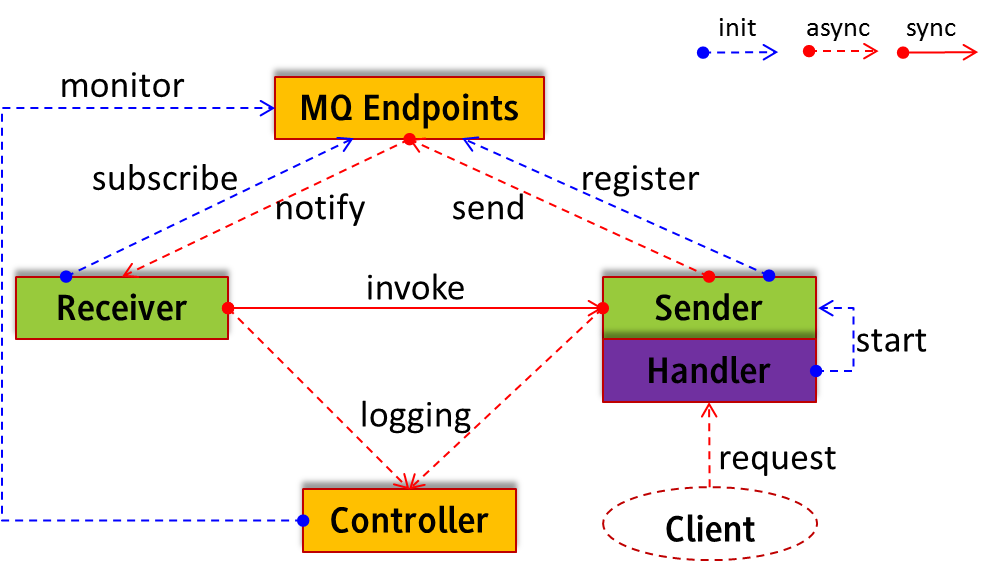

*AMNe*: Web Service Workflow Control with *AM*QP (RabbitMQ) and *Ne*tty
=================================================================

Prerequisites
-------------
1. Install RabbitMQ on the server machine (e.g. localhost), which usually requires installing Erlang
2. Start RabbitMQ service and make sure default ports are available, i.e. *5672*, *15672* and user defined service port, e.g. *18866*

Run User Tests
--------------
Most main classes have corresponding test classes except *Worker* classes, which have their own main functions to run.

Exchanges, Queues and Messages information can be monitored at [15672](http://localhost:15672/).

Architecture
------------

* A **Worker** usually consists of a pair of *Receiver* and *Sender*, where the former invokes the latter
* A **Server** is a *Worker* wrapped inside a Netty *Handler* so it can process (HTTP) requests directly from clients
* A **Workflow** should contain several *Workers* that communicate through MQ
